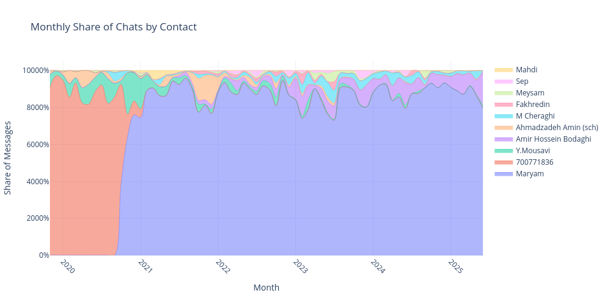

## Telegram Data Analysis Project

### Overview

This project provides tools to analyze data exported from Telegram. It processes message exports to generate insights such as monthly message counts, sender shares, conversation starters, emoji usage, chat distributions, a word cloud, and voice message statistics.

### Usage

1. **Export Data from Telegram**: Export your data via Telegram's settings. Place the extracted folder (e.g., `DataExport_YYYY-MM-DD`) in `data/`.
NOTE: Make sure to export personal chats and contacts as they're used in the notebook.
2. **Install Dependencies**:

   ```bash
   pip install pandas plotly tqdm emoji wordcloud matplotlib
   ```
3. **Configure Paths**: In the notebook, update `DATA_DIR`, `PLOT_DIR`, and `MY_ID` (your numeric user ID).
4. **Run Notebook**: Execute each cell to preprocess data, generate plots, and save images in `plots/`.

### Results and Plots

Below are the visual outputs saved in the `plots/` directory, in the order they are created.

1. **Monthly Message Count**
   
   *Shows total messages per month, with a red dashed line marking the analysis start date.*

2. **Monthly Share of Messages: Me vs Others**
   
   *Displays the proportion of messages sent by you versus others over time.*

3. **Monthly Share of Conversation Starts: Me vs Others**
   
   *Highlights who initiates conversations each month, based on 24h gaps.*

4. **Monthly Share of Popular Emojis**
   
   *Tracks the relative usage of the top emojis in your messages across months.*

5. **Monthly Share of Chats by Contact**
   
   *Shows which chats (top 10 contacts) occupy the largest share of your messages each month.*

6. **Word Cloud of Your Messages**
   
   *Visualizes the most frequent non-stopword terms in your messages.*

7. **Voice Message Statistics**

   * **Longest Voice Message**: Duration and date of your longest voice note.
   * **Median Duration**: The median length of your voice messages in seconds.

Refer to the notebook for detailed code and additional outputs.
